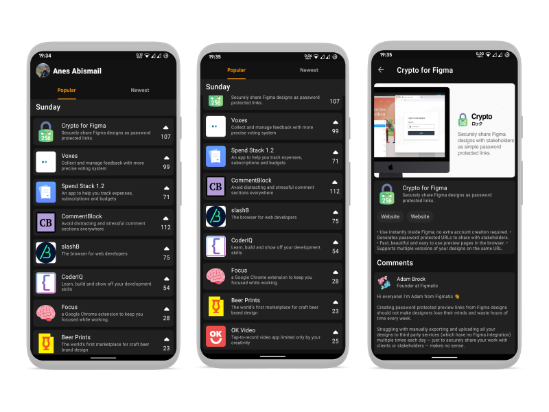

# Product hunt client

A simple product hunt client.

## Screenshots

    

## Features 🎨

- **100% Kotlin-only template**.
- 100% Gradle Kotlin DSL setup.
- Dependency versions managed via `buildSrc`.
- CI Setup with GitHub Actions.
- Kotlin Static Analysis via `ktlint`.
- Issues Template (bug report + feature request)
- Pull Request Template.

## Gradle Setup 🐘

This project is using [**Gradle Kotlin DSL**](https://docs.gradle.org/current/userguide/kotlin_dsl.html) as well as the [Plugin DSL](https://docs.gradle.org/current/userguide/plugins.html#sec:plugins_block) to setup the build.

Dependencies are centralized inside the [Dependencies.kt](buildSrc/src/main/java/Dependencies.kt) file in the `buildSrc` folder. This provides convenient auto-completion when writing your gradle files.

## Static Analysis 🔍

The project uses [**ktlint**](https://github.com/pinterest/ktlint) with the [ktlint-gradle](https://github.com/jlleitschuh/ktlint-gradle) plugin to format your code. To reformat all the source code as well as the buildscript you can run the `ktlintFormat` gradle task.

## CI ⚙️

This template is using [**GitHub Actions**](https://github.com/cortinico/kotlin-android-template/actions) as CI. You don't need to setup any external service and you should have a running CI once you start using this template.

There are currently the following workflows available:

- [Validate Gradle Wrapper](.github/workflows/gradle-wrapper-validation.yml) - Will check that the gradle wrapper has a valid checksum
- [Pre Merge Checks](.github/workflows/build-and-check.yaml) - Will run the `build`, and `check` tasks.

## Contributing 🤝

Feel free to open a issue or submit a pull request for any bugs/improvements.
